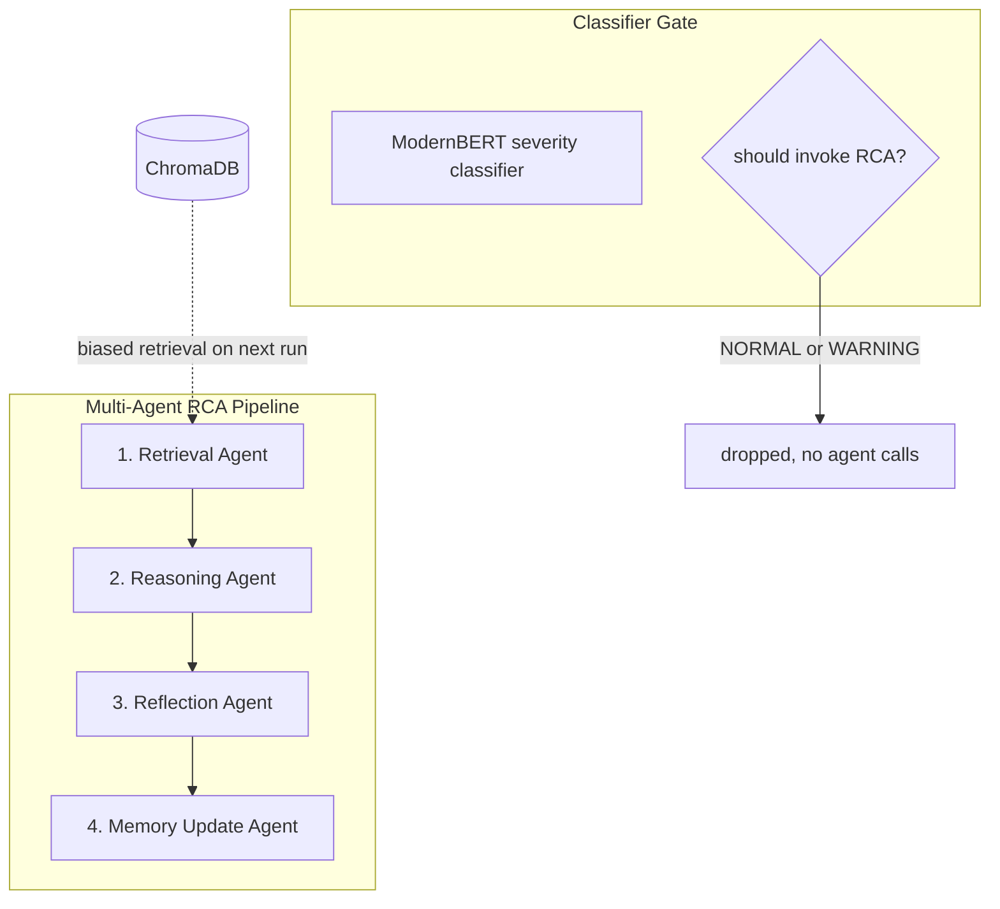

# Mermaid Diagrams — Authoring Skill

When asked to draw a diagram in this repo (architecture, flow,
sequence, etc.), produce **Mermaid** by default — it renders natively
on GitHub and inside most Markdown previewers. This skill captures the
syntactic landmines that have actually caused renderer failures, plus
the visual conventions that make a diagram readable at a glance.

> **The two most common causes of "syntax error in graph" on GitHub:**
>
> 1. **HTML or HTML entities in edge labels.** Node labels are
>    permissive; edge labels are not. When in doubt, keep edge labels
>    plain ASCII.
> 2. **Wrong dotted-edge-with-label syntax.** Dotted edges use
>    `A -. text .-> B`, *never* `A -.-> |text| B`. The pipe form
>    works only with solid arrows.

---

## Authoring rules — the safe subset

These rules will render correctly on GitHub, on `mkdocs-material`, on
the VS Code Mermaid preview, and in Obsidian. They cost a little
expressiveness but eliminate the "renders on my machine, breaks on
GitHub" class of bug.

### 1. Node labels — `<br/>` is fine, almost nothing else is

**Allowed inside `[...]`, `("...")`, `{"..."}`, `[(...)]`:**

- Plain text including spaces, dashes, slashes, parentheses **as long
  as the label is quoted with `"..."`.**
- `<br/>` for line breaks.
- Emoji (🧠, 📥, ⚙️) — render in node labels reliably.

**Forbidden in node labels:**

- `<sub>`, `<i>`, `<b>`, `<em>`, `<small>` — work on some renderers,
  silently break others.
- `&nbsp;`, `&amp;`, `&lt;`, `&gt;` — usually render literally as
  text. Use real spaces and Unicode characters instead (`±` instead
  of `&plusmn;`, regular space instead of `&nbsp;`).
- Backticks — they confuse the Markdown / Mermaid boundary.

```text
%% Good
A["Retrieval Agent<br/>finds top-k similar incidents"]

%% Bad — breaks on GitHub
A["Retrieval Agent<br/><sub>finds top-k similar incidents</sub>"]
```

### 2. Edge labels — ASCII only, no HTML, and pick the right syntax for the arrow style

This is where most "syntax error" failures originate. Mermaid's
parser for edge labels is much stricter than for node labels — and
the labelled-edge syntax is **different for solid vs dotted arrows**.

**Solid arrow `-->` — pipe form OR quoted form:**

```text
A -->|score deltas| B                      %% pipe form (preferred)
A -- "score deltas plus or minus 0.2" --> B  %% quoted form
```

**Dotted arrow `-.->` — dotted-with-label form ONLY:**

```text
A -. biased retrieval on next run .-> B    %% correct
A -. "labels with spaces work fine" .-> B  %% optional quotes
```

> **CRITICAL:** Pipe-form labels do NOT work on dotted arrows. The
> following looks intuitive but is a parse error:
>
> ```text
> A -.->|biased retrieval on next run| B    %% INVALID — common bug
> ```
>
> If you need a labelled dotted edge, use `-. text .->`. Always.

**Thick arrow `==>` — pipe form only:**

```text
A ==>|critical path| B
```

**Forbidden in edge labels (any arrow style, any renderer):**

- HTML tags of any kind (`<b>`, `<br/>`, `<sub>`, `<i>`).
- `&nbsp;` and other HTML entities.
- Unescaped `|` characters inside the label text.
- Multi-line labels — keep edge text on one line. If you really need
  two lines on an edge, use ` / ` or ` — ` as a visual separator
  inside one line, or split into two edges.

```text
%% Good
KB -->|top-k incidents and scores| A1
A1 -->|similarity query| KB
KB -. biased retrieval on next run .-> A1

%% Bad — HTML in edge label is a top cause of GitHub render failures
KB -->|<b>biased retrieval</b><br/>on next run| A1

%% Bad — dotted arrow with pipe-form label
KB -.->|biased retrieval on next run| A1
```

### 3. Subgraph titles — quoted, plain text, no HTML, no parens

```text
%% Good — short, plain title
subgraph RCA["Multi-Agent RCA Pipeline"]
    A1 --> A2
end

%% Bad — italics in subgraph titles silently render as literal <i>
subgraph RCA["Multi-Agent RCA Pipeline <i>Google ADK</i>"]
    A1 --> A2
end

%% Bad — parens inside the quoted title cause intermittent parse
%% failures on the GitHub renderer. Move the qualifier into prose
%% under the diagram, or attach it as a separate note node.
subgraph RCA["Multi-Agent RCA Pipeline (Google ADK SequentialAgent)"]
    A1 --> A2
end
```

> **Why no parens?** Some Mermaid renderer versions (including the
> one currently shipping on GitHub) get confused by `(` inside a
> double-quoted subgraph title and fail the whole graph silently
> with a generic "syntax error". Strip the parenthetical, or replace
> it with a comma: `"Multi-Agent RCA Pipeline, Google ADK"`.

### 4. Don't nest `direction` declarations unless you must

`direction TB` or `direction LR` inside a subgraph is documented as
valid, but it interacts badly with renderer auto-layout in many
Mermaid versions and is a frequent source of "renders locally,
breaks on GitHub" reports.

**Default behaviour:** the outer `flowchart TB` (or `LR`) determines
direction for the entire graph, including subgraphs. That is almost
always what you want.

```text
%% Preferred — single top-level direction declaration
flowchart TB
    subgraph S["Pipeline"]
        A --> B --> C
    end

%% Avoid unless you genuinely need a subgraph laid out differently
flowchart TB
    subgraph S["Pipeline"]
        direction LR
        A --> B --> C
    end
```

### 5. Node IDs — short, alphanumeric, no spaces

Node IDs (the part before the `[...]` label) must be a single token.
Use short PascalCase or snake_case identifiers; the human-readable
text goes in the label.

```text
%% Good
A1["Retrieval Agent"]
ChromaKB[("ChromaDB vector store")]

%% Bad — IDs cannot contain spaces or special characters
"Retrieval Agent"["Retrieval Agent"]
chroma-kb[("ChromaDB")]
```

### 6. Node shapes — pick one per role, stay consistent

| Shape | Syntax | Use for |
|---|---|---|
| Rectangle | `A["text"]` | Default: services, agents, processes. |
| Rounded | `A("text")` | Components or modules (lightweight). |
| Cylinder | `A[("text")]` | Databases, persistent stores, queues. |
| Diamond | `A{"text"}` | Decisions, gates. |
| Hexagon | `A{{"text"}}` | External systems, third-party APIs. |
| Stadium | `A(["text"])` | Start / end / terminator nodes. |

Pick one shape per *role* across the whole diagram. If databases are
cylinders, every database is a cylinder. Mixing shapes for the same
role looks like noise.

### 7. Edge styles — encode meaning, don't over-decorate

| Edge | Syntax | Use for |
|---|---|---|
| Solid arrow | `A --> B` | Normal data / control flow. |
| Bidirectional | `A <--> B` | Request / response with no clear direction. |
| Dotted arrow | `A -.-> B` | Async, optional, weak coupling, UI calls. |
| Thick arrow | `A ==> B` | Highlight a critical path or hot loop. |
| Labeled | `A -->\|text\| B` | Pipe-form label (preferred). |
| Labeled dotted | `A -. text .-> B` | Note the dotted form has no pipes. |

Three styles in one diagram is the maximum that stays readable.

### 8. Highlighting — use `classDef`, not colors-per-node

To draw the eye to one path or component, define a `classDef` once
and apply it with `class`. This is the only safe way to add color and
keeps the diagram theme-friendly.

```text
classDef novelty stroke:#d97706,stroke-width:3px,fill:#fffbeb;
class A3,A4,KB novelty;
```

`stroke` and `fill` accept any CSS color. Use **at most two
classDefs** per diagram (one for highlight, one for de-emphasis if
needed).

Avoid global theme overrides (`%%{init: {...}}%%`) unless you're
deliberately rebranding — they often break rendering on hosts that
sandbox Mermaid.

### 9. Layout direction — `TB` for hierarchies, `LR` for pipelines

Choose at the top of the file with `flowchart TB` or `flowchart LR`:

- `flowchart TB` (top-to-bottom) — for hierarchies, dependency
  graphs, anything with multiple levels.
- `flowchart LR` (left-to-right) — for pipelines, sequence-like
  flows that read like a sentence.

A diagram with one clear "input → processing → output" axis usually
reads better as `LR`. A diagram with several layers (UI / app /
data) reads better as `TB`.

### 10. Tag fragments as `text`, only complete diagrams as `mermaid`

When writing documentation **about** Mermaid (like this skill file),
illustrative snippets are rarely complete diagrams — they're
fragments showing one rule at a time. Tagging a fragment as
`` ```mermaid `` makes the renderer try to parse it as a real
diagram and fail with `UnknownDiagramError: No diagram type
detected`.

```text
%% Fragment, not a diagram -- use the text fence, not mermaid.
A -->|score deltas| B
```

Only use the `` ```mermaid `` fence when the block is a complete,
self-contained diagram starting with a diagram declaration:

- `flowchart TB` / `flowchart LR`
- `sequenceDiagram`
- `stateDiagram-v2`
- `classDiagram`
- `erDiagram`

Everything else — single-edge syntax demos, `classDef` lines, node-
label examples, partial subgraphs — should use `` ```text `` so the
reader sees the syntax verbatim and the renderer doesn't choke.

### 11. Prefer one edge per line over chained edges

Chained edges (`A --> B --> C --> D`) are valid Mermaid syntax and
render correctly on most hosts, but they are a frequent source of
subtle parser errors when combined with subgraphs, labels, or
styling. They also defeat line-by-line `git diff` review.

```text
%% Preferred — one edge per line
A1 --> A2
A2 --> A3
A3 --> A4

%% Works but more brittle and harder to diff
A1 --> A2 --> A3 --> A4
```

The semantics are identical; the multi-line form is just safer.

---

## Visual conventions for clarity

These aren't syntax — they're aesthetic rules that make a diagram
look *engineered* rather than thrown together.

### One job per node

Each node should fit in one line of explanation. If you find yourself
writing three lines inside a node, split it into two nodes connected
by an arrow.

### Group related nodes with `subgraph`

Subgraphs are visual chunking. Use them to group:

- Components belonging to the same service.
- Layers in a layered architecture (UI / business / data).
- Things deployed together.

Don't use subgraphs as decoration — every subgraph should correspond
to a real boundary in the system.

### Always label cross-boundary edges

Edges *inside* a subgraph can be unlabeled if the relationship is
obvious. Edges that *cross* subgraphs almost always benefit from a
label — they're the API contracts of the diagram.

### Order matters: top-left = origin, bottom-right = terminus

Mermaid's auto-layout respects definition order. For `TB`, the
node defined first tends to land at the top. Define your inputs
first, processing in the middle, outputs last. The diagram reads
better even when the layout engine reshuffles.

### Maximum density

A flowchart that needs more than ~15 nodes and ~25 edges is too
dense. Either:
- Split it into a "high-level" diagram and a "zoomed-in" diagram.
- Replace some sub-pieces with a single node labeled with what they
  collectively do.

A defense-slide diagram should be readable from the back of the
room. That means roughly 8-12 nodes maximum.

---

## Pre-flight checklist before committing a Mermaid diagram

Before saving a diagram into a doc, run through this list. Most
"syntax error" failures fail at least one of these:

- [ ] Every node label is wrapped in matching `[...]`, `("...")`,
      `{"..."}`, or `[(...)]`. Quotes are present whenever the label
      has spaces, slashes, parentheses, or punctuation.
- [ ] No HTML in any edge label. Search the diagram for `<` and
      verify each one is inside a node label, not an edge label.
- [ ] **All dotted edges with labels use `A -. text .-> B`,
      not `A -.-> |text| B`.** This is the single most common silent
      parse error — pipe-form labels work only on solid (`-->`) and
      thick (`==>`) arrows.
- [ ] No `&nbsp;`, `&amp;`, `&lt;`, `&gt;`, or other HTML entities
      anywhere. They render literally on most hosts.
- [ ] No HTML *or parentheses* inside subgraph quoted titles.
      Replace `"Foo (bar)"` with `"Foo, bar"` or move the qualifier
      to surrounding prose.
- [ ] No nested `direction` declarations inside subgraphs unless
      genuinely needed.
- [ ] Each edge on its own line (avoid `A --> B --> C` chains).
- [ ] Code fence is ` ```mermaid ` only if the block is a complete
      diagram (starts with `flowchart`, `sequenceDiagram`, etc.).
      Syntax fragments use ` ```text `.
- [ ] Every node ID is a single alphanumeric token.
- [ ] One shape per role, applied consistently.
- [ ] Total nodes ≤ 15 unless this is an intentional zoom-in
      diagram.
- [ ] One `classDef` per emphasis (max 2 total).
- [ ] Render preview matches expectation (use VS Code Mermaid
      preview, the GitHub pull-request preview, or the live editor at
      <https://mermaid.live>).

---

## Worked example — refactoring a broken diagram

The following block is the actual sequence of fixes that made the
top-level architecture diagram in this repo render on GitHub.

**Initial version — failed to render on GitHub:**

```text
flowchart TB
    subgraph Gate["Classifier Gate (cheap, always-on, ~50ms per chunk)"]
        Cls["ModernBERT severity classifier"]
        Decision{"should_invoke_rca?"}
    end

    subgraph RCA["Multi-Agent RCA Pipeline (Google ADK SequentialAgent)"]
        direction TB
        A1["1. Retrieval Agent"]
        A2["2. Reasoning Agent"]
        A3["3. Reflection Agent"]
        A4["4. Memory Update Agent"]
        A1 --> A2 --> A3 --> A4
    end

    Decision -- "NORMAL / WARNING&nbsp;&nbsp;<b>drop</b>" --> Drop["✖ no agent calls"]
    KB -.->|biased retrieval on next run| A1
```

Multiple things wrong, in order of severity:

1. **`KB -.->|biased retrieval on next run| A1`** — pipe-form label
   on a dotted arrow. Invalid syntax. Use `KB -. biased retrieval on next run .-> A1`.
2. **`subgraph Gate["...(...)"]`** and **`subgraph RCA["...(...)"]`** —
   parens inside quoted subgraph titles. Triggers a generic "syntax
   error" on the GitHub renderer.
3. **`<b>` and `&nbsp;` in edge labels** — HTML and HTML entities are
   forbidden in edge labels.
4. **`direction TB` nested inside a `flowchart TB`** — redundant and
   sometimes triggers layout glitches.
5. **`A1 --> A2 --> A3 --> A4` chain** — works in isolation but is
   brittle in combination with other constructs.

**Fixed version — renders cleanly:**



Each fix corresponds to one rule from the *Authoring rules* section
above. Rich detail like "(cheap, always-on, ~50ms per chunk)" is
preserved by moving it to the prose under the diagram, not into the
node text — which is also better visual design.

---

## Other diagram types — quick syntax notes

This skill is mostly about `flowchart`, the 90% case. The same
"plain-ASCII edge labels, no HTML, quoted node text" rules carry
over to:

- **`sequenceDiagram`** — message labels are like edge labels: keep
  them ASCII. Use `Note over A,B: ...` for any rich annotation.
- **`stateDiagram-v2`** — transition labels follow the same rules.
- **`erDiagram`** — relation labels are stricter still; stick to
  short verb phrases like `"places"` or `"belongs to"`.
- **`classDiagram`** — method names with generics often confuse the
  parser; quote them or simplify (`List<T>` → `List of T`).

When in doubt, paste your diagram into <https://mermaid.live> first.
The error messages there are vastly more informative than GitHub's
"syntax error in graph".
