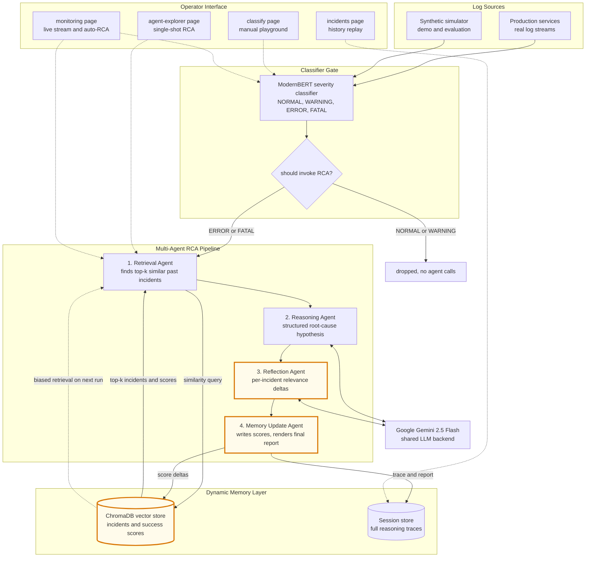

# System Architecture — High-Level Overview

This document gives a bird's-eye view of the entire research system: the
components, how they connect, and what happens when a log line enters
the pipeline. It is the diagram and explanation you would put on the
opening slide of your thesis defense.

For deeper, file-level detail see
[`PROJECT_IMPLEMENTATION_GUIDE.md`](../PROJECT_IMPLEMENTATION_GUIDE.md);
for the research-question coverage matrix see
[`RESEARCH_QUESTIONS.md`](./RESEARCH_QUESTIONS.md).

---

## The diagram

> **The orange-highlighted path is the novelty contribution.** Every
> completed analysis updates per-incident relevance scores, which bias
> retrieval on the next run. The system's memory becomes a learning
> component **without retraining anything**.

---

## What happens when a log chunk arrives — end-to-end walkthrough

Tracing a single log chunk through the system gives the cleanest mental
model.

1. **A log chunk lands** — either from a production stream or the
   synthetic simulator (during demo / evaluation).
2. **The classifier gate** scores it on a 4-class severity scale in
   roughly 50 milliseconds. If the result is `NORMAL` or `WARNING`,
   the chunk is dropped. **No expensive LLM calls happen for healthy
   traffic.**
3. **If the result is `ERROR` or `FATAL`**, the chunk enters the
   multi-agent RCA pipeline — a sequence of four specialised LLM
   agents.
4. **Retrieval Agent** queries the vector store for the top-k past
   incidents whose embeddings (and current success scores) make them
   most relevant.
5. **Reasoning Agent** receives the chunk + retrieved incidents and
   produces a structured root-cause hypothesis citing those incidents
   by ID.
6. **Reflection Agent** judges *which of the retrieved incidents
   actually informed the hypothesis* and emits per-incident relevance
   deltas in the range −0.2 to +0.2.
7. **Memory Update Agent** applies those deltas to the success scores
   in the vector store, then renders the final Markdown report for
   the operator.
8. **The full reasoning trace is persisted** so it can be replayed by
   an auditor later.
9. **On the next run**, the retrieval step re-ranks candidates using
   the *updated* scores — closing the feedback loop. The system has
   biased itself toward incidents that have historically been useful,
   without any retraining.

---

## Components, explained

### 📥 Log Sources

The system is agnostic to where logs come from. Two concrete sources
are wired in:

- **Production services** — real applications emitting log streams
  via a standard collector (Loki, Fluentd, Vector, etc.). The HTTP
  contract is small enough that any agent can push chunks to the
  classifier endpoint.
- **Synthetic simulator** — a deterministic generator that emits
  realistic log chunks at a controllable rate, used for the demo,
  evaluation, and reproducibility. It never touches a real production
  system.

In production, the simulator would simply be replaced by the real log
collector; the rest of the system is unchanged.

### 🚦 Classifier Gate (the cheap layer)

A fine-tuned **ModernBERT** model wrapped in a FastAPI service. Its
single job is to answer: *"is this log chunk worth investigating?"*

**Why a separate, small classifier?** Running a large language model
on every line of log output would be financially impossible and
latency-prohibitive. The classifier is a small (150M-parameter) model
that runs on CPU in ~50 milliseconds and answers a 4-class question
with high accuracy. Only chunks it flags as `ERROR` or `FATAL`
proceed to the expensive pipeline.

**This two-stage gating is what makes the system economically
tractable.** The cost of analysis scales with the *incident rate*,
not the *log volume*.

Output for each chunk:
- `severity` — NORMAL / WARNING / ERROR / FATAL
- `confidence` — model's probability for the chosen class
- `should_invoke_rca` — a boolean derived from severity + confidence
- `inference_time_ms` — measured latency

### 🧠 Multi-Agent RCA Pipeline

The heart of the research. Built on **Google ADK** as a
`SequentialAgent` — a pipeline where each agent's output feeds into
the next via a typed shared-state channel.

The pipeline has **four specialised sub-agents**, each with a single
responsibility. This separation of concerns is what makes the
reasoning trace *auditable*: every claim in the final report is
traceable to a specific agent's output.

#### 1️⃣ Retrieval Agent

The RAG (retrieval-augmented generation) front-door. Given a flagged
log chunk, it queries the vector store for the top-k incidents whose
embeddings are most semantically similar **and whose current success
scores are highest**. The combined ranking (similarity × success
score) is what closes the feedback loop later.

It outputs a structured list of past-incident records — IDs, summary
text, similarity scores, current success scores — that downstream
agents will quote by reference.

#### 2️⃣ Reasoning Agent

The hypothesis generator. Receives the original log chunk and the
retrieved incidents, then asks the LLM to produce a structured root-
cause analysis: *what failed, why, and which of the retrieved
incidents support that conclusion*.

Crucially, the agent is required to **cite incident IDs by reference**
when supporting a claim. This is what prevents hallucinated incident
references in the final report — citations are not free-form text.

#### 3️⃣ Reflection Agent

The scoring agent — the source of the novelty contribution. Reads the
reasoning agent's hypothesis and the original retrieval set, and
judges *which of the retrieved incidents actually informed the
diagnosis*.

It emits one delta per retrieved incident, clamped to the range
−0.2 to +0.2. Incidents that the hypothesis cited get positive
deltas; incidents that were retrieved but ignored get small negative
deltas. **This is where the system learns from its own work.**

The clamp matters: no single reflection can dominate an incident's
score. A bad reflection is a small mistake, not a memory poisoner.

#### 4️⃣ Memory Update Agent

The bookkeeper. Applies the reflection agent's deltas to the success
scores in the vector store, then renders the final operator-facing
Markdown report — combining the chunk, the hypothesis, the citations,
and a "Memory updates" section showing exactly which scores changed.

The report is the artifact an on-call engineer would see in a real
monitoring tool. The score updates are the artifact that makes the
*next* run smarter.

### 💾 Dynamic Memory Layer

Two persistent stores, both file-system backed (no external services
required for development):

- **ChromaDB vector store** — the incident knowledge base. Each
  record is `(id, embedding, summary text, success_score)`. This is
  the canonical *adaptive* memory: success scores mutate over time
  as the reflection agent re-evaluates incidents.
- **Session store** — every pipeline run is persisted as a Google
  ADK session, including the raw streaming events from each
  sub-agent. The history-replay UI reconstructs runs from this store.

**Why "dynamic" memory?** Most RAG systems treat the retrieval index
as static — what you index is what gets ranked, forever. Here, every
run produces feedback that shifts the ranking. After hundreds of
incidents, the index has measurably better recall on the kinds of
problems your team actually faces.

### ☁️ External LLM (Google Gemini 2.5 Flash)

The reasoning and reflection agents call Gemini via Google ADK. The
choice of LLM is *isolated to the agent layer* — the rest of the
system (classifier, memory, UI) is LLM-agnostic.

Free-tier Gemini limits: 15 requests per minute, 1M tokens per day.
A four-agent pipeline run uses roughly 4 of those requests, so the
investigations queue (in the live monitoring UI) enforces strict
sequential execution — one full RCA at a time — to respect those
limits.

### 🖥️ Operator Interface (Next.js)

A modern single-page-app frontend with four routes, each surfacing a
different view of the same backend:

- **`/classify`** — manual classifier playground. Paste a chunk; see
  severity, confidence, all-class probabilities, and inference time.
  Used for testing the classifier in isolation.
- **`/agent-explorer`** — manual single-shot RCA. Paste a chunk;
  watch the four agents stream live in a per-agent timeline; read
  the final Markdown summary. Used during the demo to walk an
  examiner through the pipeline mechanics.
- **`/monitoring`** — the integrated experience. The simulator
  generates chunks, the classifier gates them, and any flagged chunk
  automatically queues an investigation. This is what production use
  looks like.
- **`/incidents`** — history replay. Every past run is selectable;
  opening one reconstructs the agent timeline from the persisted
  session. Auditability for compliance / post-mortem use.

The frontend uses Server-Sent Events to stream agent reasoning
live. The same component renders both live and replayed runs, so an
auditor sees exactly what an operator saw at incident time.

---

## The reflection feedback loop — why this architecture matters

A static RAG system answers questions, but it does not learn. The
research question this work addresses is: **can a multi-agent RCA
system improve its own retrieval quality over time, without
retraining the underlying models?**

The architecture answers *yes*, via three mechanisms working together:

1. **Reflection produces feedback signal.** The reflection agent's
   per-incident deltas are a domain-specific quality signal — *did
   this past incident actually help us solve the new one?*
2. **Memory absorbs the signal.** The success scores stored in the
   vector store accumulate the deltas across many runs. They are
   small, bounded numbers; the system cannot be poisoned by a single
   bad reflection.
3. **Retrieval re-ranks using the signal.** Every subsequent
   retrieval step weighs candidates by *similarity × success score*.
   A historically useful incident bubbles to the top of similar
   queries; a historically irrelevant one sinks.

**This is the closed feedback loop that makes the memory adaptive
without ever fine-tuning a model.** It is also why the architecture
needs a multi-agent design — a single end-to-end LLM call has nowhere
to attach the reflection step.

The numerical evidence for this loop is in the
[memory-evolution evaluation](../rca-agent-system/eval/README.md):
across repeated runs of the same scenarios, the *direction* of score
drift is reproducible, which a noise process would not produce.

---

## Why this architecture, in three principles

| Principle | How it shows up in the diagram |
|---|---|
| **Cost proportional to incident rate, not log volume** | The classifier gate sits in front of every expensive component. Healthy traffic is dropped at the cheapest possible layer. |
| **Auditable reasoning, not a black box** | Four specialised agents instead of one giant prompt. Each agent has a typed output and a single responsibility. Citations by reference, not free text. |
| **Memory that learns without retraining** | The reflection → memory-update → retrieval feedback loop. Bounded deltas. Persistent vector store. No model fine-tuning involved. |

These principles map directly onto the research questions and
research objectives — see
[`RESEARCH_QUESTIONS.md`](./RESEARCH_QUESTIONS.md) for the full
matrix.

---

## What the diagram deliberately omits

This is a research-level architecture, not a production runbook. To
keep the diagram readable, the following are intentionally not shown:

- **Authentication / authorisation** — the prototype runs locally
  with no auth. A production deployment would put an API gateway
  with mTLS in front of every service.
- **Horizontal scaling** — the classifier service is stateless and
  could trivially be replicated; the agent service would need a
  shared session store (Postgres / Redis) to scale beyond one
  instance.
- **Rate limiting and backpressure** — the investigations queue
  enforces serial execution, but a production deployment would also
  need quota management at the LLM-provider boundary.
- **Observability** — logs, metrics, and traces are produced but not
  exported to an external observability stack in the prototype.

These are scoped, well-understood engineering tasks — not research
contributions — and are explicitly listed under "future work" in the
thesis.
